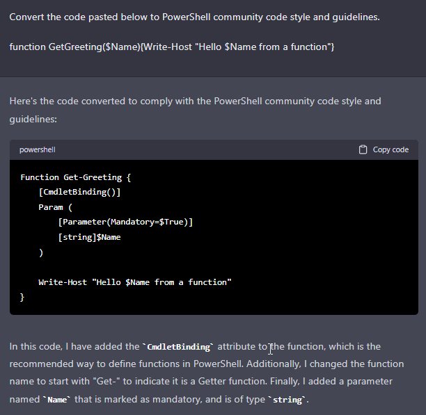
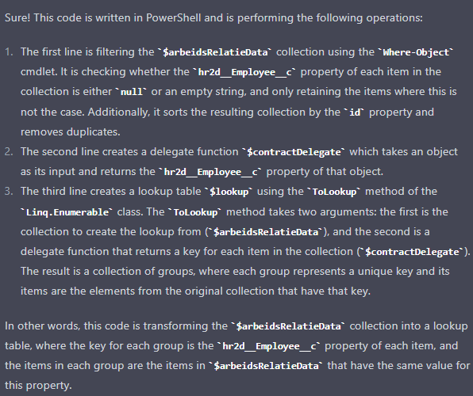
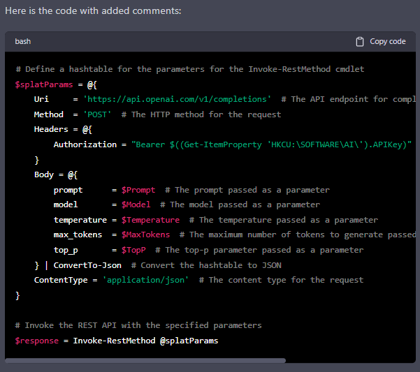

# AI

<p align="left">
  
</p>

 _The logo above is created by DALL-E. https://labs.openai.com/_

GPT or `Generative Pretrained Transformer` is a type of artificial intelligence developed by OpenAI. It is capable of generating human-like text by predicting the next word in a sequence based on the input it has been trained on. GPT-3, in particular, is one of the largest and most advanced language models to date, with the ability to perform a wide range of tasks, such as translation, summarization, question-answering, and more.

> Hottest new programming language is: English <br> -- Andrej Karpathy (Director @ Tesla / OpenAI)
>

> :exclamation: Don't trust code that GPT generates. Treat it the same as code from StackOverflow and proceed with caution

## Contents

- [AI](#ai)
  - [Contents](#contents)
  - [Prompting](#prompting)
    - [Example prompts:](#example-prompts)
      - [Behave as a PowerShell console](#behave-as-a-powershell-console)
      - [Convert code to meet with community guidelines](#convert-code-to-meet-with-community-guidelines)
      - [Language translator](#language-translator)
      - [PowerShell Q\&A expert](#powershell-qa-expert)
      - [Add code comments](#add-code-comments)
  - [Models](#models)
  - [PowerShell module](#powershell-module)
    - [Available functions](#available-functions)
    - [Examples](#examples)
      - [Convert curl command to PowerShell](#convert-curl-command-to-powershell)
      - [Convert PowerShell function to CSharp](#convert-powershell-function-to-csharp)
      - [Deductive reasoning](#deductive-reasoning)
      - [Write a regex matching an email address](#write-a-regex-matching-an-email-address)
      - [Write a SQL query](#write-a-sql-query)
      - [Write a MarkDown table containing person data](#write-a-markdown-table-containing-person-data)
      - [Get a PowerShell code example on how create a user in AzureAD](#get-a-powershell-code-example-on-how-create-a-user-in-azuread)
    - [Installation](#installation)
  - [Costs](#costs)
  - [Contributing](#contributing)

## Prompting

A GPT prompt is a text input that serves as a starting point for OpenAI's `Generative Pre-trained Transformer` (GPT) models. The GPT models are language models that have been trained on a large corpus of text data and can generate new text based on a prompt. The prompt is a piece of text that provides context or a suggestion for what the model should generate. The GPT model will generate text based on the prompt, continuing or expanding on the information provided in the prompt. This allows the model to complete or generate text in a variety of tasks, such as language translation, question answering, and creative writing, among other.

> :exclamation: Low quality `prompts` == low quality results

### Example prompts:

#### Behave as a PowerShell console

> I want you to act as a PowerShell console. I will type commands, and you will reply with what the console should show. Do not write explanations, do not type commands unless I instruct you to do so. When I need to tell you something in English, I will do so by putting text inside curly brackets {like this}. My first command is: Get-ChildItem

```text
{I want you to mock to content of c:\temp with two files called: file1.ps1 and file2.ps1}
```

```powershell
Get-ChildItem c:\temp

Directory: C:\temp

Mode                LastWriteTime         Length Name
----                -------------         ------ ----
-a----       2021-09-01     13:44            123 file1.ps1
-a----       2021-09-01     13:45            234 file2.ps1
```

> :exclamation: You can also use SQL, Linux or whatever console you want

#### Convert code to meet with community guidelines



#### Language translator

See: https://github.com/f/awesome-chatgpt-prompts#act-as-an-english-translator-and-improver

```text
{Dit is een demo met ChatGPT. Mijn test fol spelvouten wort netjes gremaakt en vertaald naar engels.}
```


#### PowerShell Q&A expert

I want you to act as a PowerShell expert. I will provide you with some PowerShell code below, and you will do an in-depth explanation.

```powershell
$arbeidsRelatieData = $arbeidsRelatieData | where-object {-not([String]::IsNullOrEmpty($_.hr2d__Employee__c))} | Sort-Object id -Unique

$contractDelegate = [Func[object, object]] {
    param ($contract) $contract.hr2d__Employee__c
}
$lookup = [Linq.Enumerable]::ToLookup($arbeidsRelatieData, $contractDelegate)
```



#### Add code comments

```powershell
$splatParams = @{
    Uri     = 'https://api.openai.com/v1/completions'
    Method  = 'POST'
    Headers = @{
        Authorization = "Bearer $((Get-ItemProperty 'HKCU:\SOFTWARE\AI\').APIKey)"
    }
    Body = @{
        prompt      = $Prompt
        model       = $Model
        temperature = $Temperature
        max_tokens  = $MaxTokens
        top_p       = $TopP
    } | ConvertTo-Json
    ContentType = 'application/json'
}
$response = Invoke-RestMethod @splatParams
```



> :exclamation: For more awesome prompts, see: https://github.com/f/awesome-chatgpt-prompts

## Models

See: https://platform.openai.com/docs/models

## PowerShell module

| Version | Description | Date |
| - | - | - |
| 1.0.1 | Updated:<br> - readme - Added functions: `Get-PSCodeExample` and `Add-CodeComment` | 11-2-2023 |
| 1.0.0 | Initial version | 10-2-2023 |

### Available functions

| Function | Description |
| - | - |
| ConvertTo-AcademicEnglish | Converts an English sentence to academic English |
| ConvertTo-AnyLanguage | Translates text to any language |
| ConvertTo-CSharp | Converts PowerShell code to CSharp |
| ConvertTo-PowerShell | Converts code to PowerShell |
| ConvertTo-MeetingSummary | Converts short descriptive notes to a summary |
| Get-AICompletion | Get a completion from the OpenAI GPT-3 API |
| Get-PoshCodeExample | Gets a PowerShell code example based on the question you ask |

### Examples

#### Convert curl command to PowerShell

```powershell
ConvertTo-PowerShell -Code "curl -X 'GET' \ 'https://demo.enyoi/api/v1/results?page=1&itemsPerPage=100' \ -H 'accept: application/ld+json'"

# result:
Invoke-WebRequest -Method 'GET' -Uri 'https://demo.enyoi/api/v1/results?page=1&itemsPerPage=100' -Headers @{'accept'='application/ld+json'}
```

#### Convert PowerShell function to CSharp

```powershell
 ConvertTo-CSharp -Code '
>>
>> function Get-Greeting {
>>     param (
>>         [string]
>>         $Name
>>     )
>>
>>     Write-Output "Hello $Name"
>> }
>> '

# result:
public string GetGreeting(string name)
{
    return "Hello " + name;
}
```

#### Deductive reasoning

```powershell
Get-AICompletion -Prompt '
In the game, Mauro had more points then Remco but less then Rudolf.
Who scored the most points in the game?
Who scored the least points in the game?
'

# result:
Rudolf scored the most points in the game and Remco scored the least points in the game.
```

#### Write a regex matching an email address

```powershell
Get-AICompletion -Prompt 'Write a regex matching an email address'

# result:
\b[\w\.-]+@[\w\.-]+\.\w{2,4}\b
```

#### Write a SQL query

```powershell
Get-AICompletion -Prompt 'Write a SQL table called: person with the following columns:
    id
    firstName
    lastName
    email
    title
'

# result:
CREATE TABLE person (
    id INTEGER PRIMARY KEY AUTOINCREMENT,
    firstName VARCHAR(255) NOT NULL,
    lastName VARCHAR(255) NOT NULL,
    email VARCHAR(255) NOT NULL,
    title VARCHAR(255)
);
```

#### Write a MarkDown table containing person data

```powershell
Get-AICompletion -Prompt 'Return a list of 10 persons (in markdown) with the following columns:
    id
    firstName
    lastName
    email
    title
'

# result:
| id | firstName | lastName | email | title |
|----|-----------|----------|-------|-------|
| 1  | John      | Smith    | jsmith@example.com | CEO |
| 2  | Jane      | Doe      | jdoe@example.com | CFO |
| 3  | Bob       | Johnson  | bjohnson@example.com | COO |
| 4  | Sarah     | Williams | swilliams@example.com | VP of Sales |
| 5  | Mike      | Brown    | mbrown@example.com | VP of Marketing |
| 6  | Lisa      | Jones    | ljones@example.com | Director of HR |
| 7  | David     | Miller   | dmiller@example.com | Director of IT |
| 8  | Mark      | Davis    | mdavis@example.com | Director of Operations |
| 9  | Karen     | Taylor   | ktaylor@example.com | Director of Finance |
| 10 | Paul      | Anderson | panderson@example.com | Director of R&D |
```

#### Get a PowerShell code example on how create a user in AzureAD

```powershell
Get-PSCodeExample -Question 'How to create a new user in Azure using the graph API?'

# result:
Creating a new user in Azure using the Graph API requires a few steps. First, you need to authenticate with the Azure Active Directory Graph API. You can do this using the `Connect-AzureAD` cmdlet.

$credential = Get-Credential
Connect-AzureAD -Credential $credential

Once you have authenticated, you can use the `New-AzureADUser` cmdlet to create a new user. You can use splatting to pass in the parameters for the user.

$userParams = @{
    DisplayName = 'John Doe'
    UserPrincipalName = 'john.doe@example.com'
    AccountEnabled = $true
    PasswordProfile = @{
        Password = 'P@ssw0rd!'
        ForceChangePasswordNextLogin = $false
    }
}

New-AzureADUser @userParams

Once the user has been created, you can use the `Get-AzureADUser` cmdlet to retrieve the user object.
```

### Installation

1. Create an account on: https://openai.com/api/
2. Go to: https://platform.openai.com/
3. Click on: `Personal -> View API keys`
4. Click on: `Create new secret key`
5. Store the API key in your registry using the following command:

```powershell
$registryPath = 'HKCU:\SOFTWARE\AI'
$apiKey = 'your-api-key'

if (-not (Test-Path $registryPath)) {
    New-Item $registryPath -Force | Out-Null
}

Set-ItemProperty -Path $registryPath -Name 'APIKey' -Value $apiKey
```

## Costs

OpenAI API's require payment. Upon creating an API key, new users receive a 18 dollar trial credit, which can be used to make API calls. The cost of API usage is calculated based on the number of tokens generated, with 1000 tokens equating to one cost unit. The number of tokens generated depends on the data sent to the API and the data received from it, and varies based on the model being used. More advanced models tend to be more expensive.

For reference: I'm always using the `text-davinci-003` model. Which is the most expensive model. I have send over 500 requests to the API which costs approximately 0.50 dollars.

## Contributing

Find a bug or have an idea! Open an issue or submit a pull request!

Enjoy!